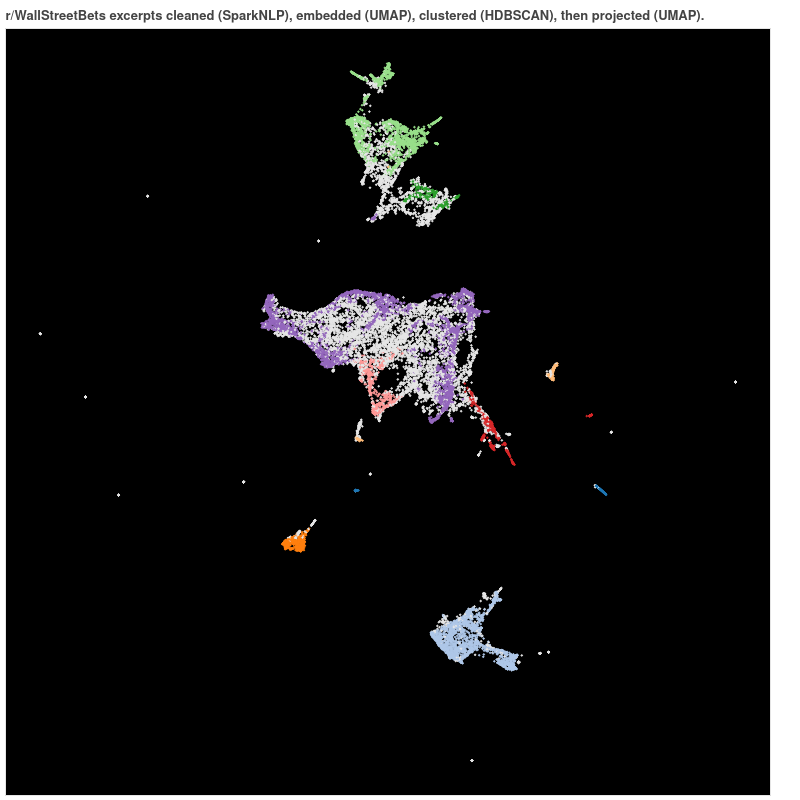

# WSB-posts

🏗 Under construction 🏗

Analysis of Wall Street Bets posts (dataset here: https://www.kaggle.com/gpreda/reddit-wallstreetsbets-post). I aim to go beyond direct sentiment analysis, to better understand the evolution of topics within the WSB sphere.

✔: Exploration of the data: [here (basic)](./notebooks/eds.ipynb), [here (lda pipeline development)](./notebooks/lda_pipeline_development.ipynb), [here (emojis)](./notebooks/eds.ipynb), [here (cleaning)](./notebooks/embedding_prep.ipynb) and [here (more on cleaning)](./notebooks/embedding_prep_2.ipynb).

✔: SparkNLP pipelines for topic modeling with emojis, and with n-gram extraction using POS tagging. 
  - [Demo here](./notebooks/lda_topic_modeling.ipynb).

✔: SparkNLP preprocessing ⇝ [Universal Sentence Encoder CMLM](https://tfhub.dev/google/universal-sentence-encoder-cmlm/en-base/) ⇝ dimensionality reduction and clustering  ⇝ interactive Bokeh plot.
  - [Embedding and clustering here](./WSB-clustering.ipynb)
  - [Ploting here](./notebooks/plot_embedding.ipynb)

Next: Refined topic modeling.

